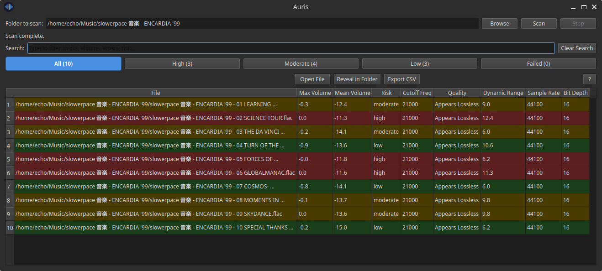

# Auris

**Auris** is a desktop audio library scanner for Linux, built for anyone who cares about the quality of their music.

It scans your music folders and gives you a deep technical analysis of every file — revealing clipping issues, dynamic range, true audio quality, and whether your "lossless" files are actually lossless.

---



---

## Features

- **Clipping risk detection** — identifies tracks with dangerously loud peaks
- **Dynamic range measurement** — reveals over-compressed or heavily limited tracks
- **True lossless detection** — uses spectral analysis to detect transcoded files (fake FLACs)
- **Frequency cutoff estimation** — identifies where audio content drops off
- **Sample rate & bit depth reporting** — full technical breakdown per file
- **Multi-threaded scanning** — fast parallel analysis of large libraries
- **Progress bar with stop button** — cancel scans at any time
- **Filter & search** — filter by risk level, search by filename or metadata
- **Export CSV** — save results for further analysis
- **Dark & light mode** — automatically follows your system theme
- **Open / Reveal in Folder** — quickly act on flagged files
- **Built-in help** — plain language explanations of every metric

---

## How It Works

Auris uses **FFmpeg** to perform a single-pass analysis of each audio file, extracting:

- Peak and mean volume (for clipping risk)
- Frequency band energy above 16kHz and 20kHz (for lossless detection)
- Dynamic range (peak vs RMS)
- Sample rate and bit depth (via FFprobe)

Results are displayed in an interactive table with color-coded risk levels and exportable as CSV.

---

## Understanding Your Results

| Column | What it means |
|---|---|
| `max_volume` | Loudest peak in dBFS. Close to 0.0 dB = clipping risk |
| `mean_volume` | Average loudness. Helps identify compression |
| `risk` | High / Moderate / Low clipping risk |
| `cutoff_freq` | Estimated frequency cutoff. 21000 = lossless, 15000 = lossy |
| `quality` | Excellent / Likely Lossy / Low Quality Lossy |
| `dynamic_range` | Higher = more natural. Below 8 dB = heavily compressed |
| `sample_rate` | 44100 = CD quality. 96000+ = hi-res |
| `bit_depth` | 16-bit = CD. 24-bit = studio quality |

---

## Requirements

- Linux
- FFmpeg
- libfuse2 (only needed for AppImage)
- Python 3.12+ (only needed if running from source)

---

## Installation (AppImage — recommended)

1. Download `Auris-x86_64.AppImage` from the [latest release](https://github.com/noisetta/auris/releases)
2. Make it executable and run:

```bash
chmod +x Auris-x86_64.AppImage
./Auris-x86_64.AppImage
```

Install dependencies if needed (Ubuntu/Debian/Pop!_OS):

```bash
sudo apt install ffmpeg libfuse2
```

## Installation (from source)

```bash
git clone https://github.com/noisetta/auris.git
cd auris
python3 -m venv venv
source venv/bin/activate
pip install -r requirements.txt
python app.py
```

---

## Dependencies

- [PySide6](https://pypi.org/project/PySide6/) — GUI framework
- [FFmpeg](https://ffmpeg.org/) — audio analysis engine

---

## Contributing

Contributions are welcome. Feel free to open issues or pull requests on GitHub.

---

## Support Auris

If Auris is useful to you, consider supporting development:

☕ [Ko-fi](https://ko-fi.com/noisetta) — one-time tip

---

## License

MIT License — free to use, modify, and distribute.

---

